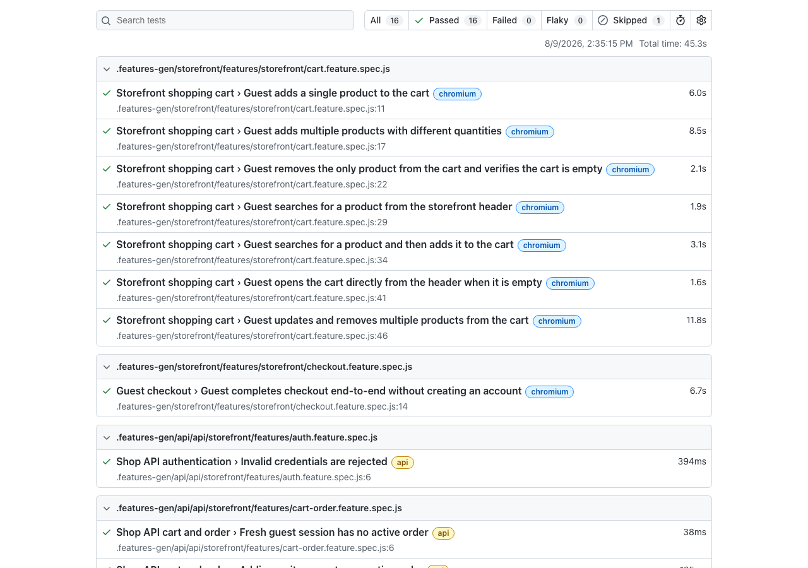

# Playwright Vendure Framework

[](https://github.com/nimanthafernandoqa/playwright-vendure-framework/actions/workflows/playwright.yml)

A professional QA automation framework built with Playwright, TypeScript,
and BDD (Gherkin) for the [Vendure](https://vendure.io) e-commerce platform.
It covers storefront UI journeys across desktop and mobile web, plus
Vendure Shop GraphQL API behaviour, with reusable fixtures, helper layers,
environment-based configuration, and GitHub Actions CI.



_Playwright's own HTML report from a passing desktop UI + Shop API run.
The framework now also includes a `mobile-chrome` project for responsive
mobile web coverage. Generate the latest report locally with
`npm test && npm run report`._

---

## What this project is, and how it got here

This started as a plain Playwright + TypeScript suite using the Page
Object Model (`pages/`) against the Vendure storefront. It has since been
deliberately evolved, step by step, into what it is now:

1. **UI tests converted to BDD.** The original `test()` blocks were
   rewritten as Gherkin scenarios (`features/*.feature`) with step
   definitions (`steps/*.steps.ts`) implemented on top of the _same_
   Page Objects — BDD sits on top of the Page Object Model, it doesn't
   replace it. [playwright-bdd](https://vitalets.github.io/playwright-bdd/)
   generates real Playwright test files from the `.feature` files, so
   everything still runs through Playwright's own runner, reporter, and
   trace viewer.
2. **Cart coverage expanded**: add single/multiple products, remove a
   product, and mixed reduce/remove updates via a Gherkin data table —
   see `features/storefront/cart.feature`.
3. **CI/CD added**, with one real constraint: the Vendure app under test
   only runs on a local machine, it isn't deployed anywhere public. See
   [CI/CD](#cicd) below for how that's handled.
4. **Unrelated practice code split out.** Interview-style practice
   exercises (alerts, frames, dropdowns, etc.) that had accumulated
   alongside this framework now live in their own separate project,
   `playwright-practice`, so this repo stays focused as a single,
   coherent portfolio piece.
5. **Guest checkout added.** A full end-to-end flow — contact details,
   shipping address, delivery method, payment, order confirmation —
   without creating an account. See `features/storefront/checkout.feature`
   and `pages/storefront/CheckoutPage.ts`.
6. **Shop API coverage added.** Product, cart/order mutation, and
   authentication scenarios now live under `api/storefront/`, using
   Playwright's `request` fixture to test Vendure's Shop GraphQL API
   directly without a browser.
7. **Mobile web project added.** The same storefront BDD scenarios can
   run against a mobile Chromium viewport, giving responsive web coverage
   without introducing native mobile-app tooling.

If you're new to this codebase, that ordering is also the recommended
reading order:

- UI: `features/` → `steps/` → `fixtures/` → `pages/`
- API: `api/storefront/features/` → `api/storefront/steps/` →
  `api/storefront/fixtures/` → `api/storefront/helpers/`

---

## Tech Stack

- Playwright + TypeScript
- [playwright-bdd](https://vitalets.github.io/playwright-bdd/) (Gherkin
  `.feature` files → native Playwright tests)
- Desktop and mobile web projects using Playwright browser/device profiles
- Vendure Shop GraphQL API testing through Playwright `request`
- Node.js
- ESLint + Prettier
- GitHub Actions (self-hosted runner)

---

## Project Structure

```
vendure-qa-automation
│
├── features/storefront/       # Gherkin .feature files — BDD scenarios,
│   ├── cart.feature           #   plain-English Given/When/Then
│   └── checkout.feature       #   guest checkout, end-to-end
│
├── steps/storefront/           # Step definitions implementing the .feature
│   ├── cart.steps.ts           #   files — orchestrates Page Object calls
│   └── checkout.steps.ts
│
├── fixtures/storefront/        # Playwright fixtures — construct each Page
│   └── fixture.ts              #   Object and inject it into step functions
│
├── pages/storefront/           # Page Object Model — locators + actions/
│   ├── HomePage.ts             #   assertions for one page/component each
│   ├── ProductListPage.ts
│   ├── ProductDetailsPage.ts
│   ├── ShoppingCartPage.ts
│   ├── CheckoutPage.ts
│   └── components/
│       └── HeaderComponent.ts  # Reusable header (cart icon), composed
│                                #   into ProductDetailsPage
│
├── utils/
│   └── env.ts                  # Central env config (UI + API URLs)
│
├── docs/
│   └── CI-SETUP.md             # Step-by-step self-hosted runner setup
│
├── api/storefront/             # Vendure Shop GraphQL API BDD coverage
│   ├── features/               #   products, cart/order, authentication
│   ├── steps/                  #   step definitions for API scenarios
│   ├── fixtures/               #   typed API state shared between steps
│   └── helpers/                #   reusable GraphQL request/assert helpers
│
├── .github/workflows/
│   └── playwright.yml          # CI/CD pipeline (self-hosted runner)
│
├── .env.example                # Template for local .env (copy, don't commit)
├── eslint.config.mjs
├── .prettierrc.json / .prettierignore
├── playwright.config.ts
├── tsconfig.json
├── package.json
└── README.md
```

Tests are generated from UI and API `.feature` files into `.features-gen/`
by `playwright-bdd` — that folder is gitignored and regenerated on every
run (`npm run bddgen`), never edited by hand.

---

## How the pieces fit together

For a concrete example, here's what happens when
`npm run test:ui` runs the "Guest adds a single product to the cart"
scenario:

1. **`features/storefront/cart.feature`** declares the scenario in plain
   English: open a product, add a quantity, expect a cart count.
2. **`playwright-bdd`** (via `npm run bddgen`) parses that Gherkin and
   generates a real Playwright test into `.features-gen/`, matching each
   line to a step definition by its text.
3. **`steps/storefront/cart.steps.ts`** provides those step definitions —
   e.g. `When('I open the product {string}', ...)` — each one calling
   into a Page Object rather than containing locators itself.
4. **`fixtures/storefront/fixture.ts`** is what makes `homePage`,
   `productListPage`, etc. available as parameters inside those step
   functions — Playwright constructs a fresh instance of each Page Object
   per test automatically.
5. **`pages/storefront/*.ts`** hold the actual locators, clicks, and
   assertions for each page — this is the only layer that should know
   about the storefront's HTML/DOM.

If you need to add a new UI scenario, see
[Writing a new UI test](#writing-a-new-ui-test-bdd) below — you'll touch
these same five places.

API scenarios follow the same BDD idea, but without Page Objects:

1. **`api/storefront/features/*.feature`** declares the API behaviour in
   plain English.
2. **`api/storefront/steps/*.steps.ts`** turns each Gherkin step into a
   real GraphQL query or mutation.
3. **`api/storefront/helpers/shop-api.ts`** sends the HTTP POST request to
   the Vendure Shop API and performs common response checks.
4. **`api/storefront/fixtures/api.fixture.ts`** provides typed test state
   so one step can save an API result and another step can assert it.

---

## Getting Started

Clone the repository and install dependencies:

```bash
git clone https://github.com/nimanthafernandoqa/playwright-vendure-framework.git vendure-qa-automation
cd vendure-qa-automation
npm install
npx playwright install --with-deps chromium
```

Copy the env template and adjust it if your local Vendure storefront or
Shop API runs on different ports:

```bash
cp .env.example .env
```

Make sure your local Vendure app is running (storefront + server), then:

```bash
npm test            # generate BDD tests + run everything
npm run test:ui     # storefront UI (BDD) scenarios only
npm run test:mobile # storefront mobile web (BDD) scenarios only
npm run test:api    # Shop API (BDD) scenarios only
npm run report      # open the last HTML report
```

> Looking for the Playwright practice/study exercises (alerts, frames,
> dropdowns, etc.)? Those now live in a separate sandbox project,
> [`playwright-practice`](../playwright-practice), kept out of this repo so
> it stays focused as a portfolio piece.

Other useful scripts: `npm run lint`, `npm run format`, `npm run bddgen`
(regenerate `.features-gen/` after editing a `.feature` or step file),
and `npx tsc --noEmit` for a TypeScript-only safety check.

---

## Writing a new UI test (BDD)

1. Add or extend a scenario in `features/storefront/*.feature` using plain
   Gherkin (`Given`/`When`/`Then`).
2. Implement any new step text in `steps/storefront/*.steps.ts`, calling
   into the Page Objects in `pages/storefront/` (add a new Page Object
   there if you're covering a new page).
3. If the step needs a new Page Object, register it as a fixture in
   `fixtures/storefront/fixture.ts` so it's available in step functions.
4. Run `npm run test:ui` — this regenerates `.features-gen/` and runs it.

The `mobile-chrome` project runs those same storefront BDD scenarios in a
mobile web viewport. This is responsive website testing, not native
Android/iOS app testing. Use `npm run test:mobile` when you want to check
mobile layout and interaction behaviour separately.

---

## Writing a new API test (BDD)

1. Add or extend a scenario in `api/storefront/features/*.feature`.
2. Implement any new step text in `api/storefront/steps/*.steps.ts`.
3. Use `shopApi()` from `api/storefront/helpers/shop-api.ts` for GraphQL
   queries/mutations, so API calls and response handling stay consistent.
4. Store shared data in `apiState` from
   `api/storefront/fixtures/api.fixture.ts` when one step needs to use
   the result from a previous step.
5. Run `npm run test:api`.

Current Shop API coverage includes:

- Product list and product-by-slug queries
- Negative product lookup for an unknown slug
- Guest active order checks
- Add item to order mutation
- Invalid quantity mutation rejection
- Invalid login rejection
- Optional valid customer login, enabled only when safe local credentials
  are configured in `.env`

---

## CI/CD

GitHub Actions runs the full suite on push to `main` (and on demand).

**The constraint that shapes this setup:** the Vendure app under test only
runs locally — there's no publicly deployed URL a normal cloud-hosted CI
runner could reach. The fix is a **self-hosted runner**: a small agent
installed on the same machine the app runs on, so when GitHub triggers the
workflow, it executes right there where `localhost` is real.

For that same reason, the workflow deliberately does **not** trigger on
`pull_request` — a self-hosted runner executes on a real machine, and that
trigger would let anyone opening a PR run code on it.

See [`docs/CI-SETUP.md`](docs/CI-SETUP.md) for the step-by-step runner
setup, and [`.github/workflows/playwright.yml`](.github/workflows/playwright.yml)
for the workflow itself (annotated with the same reasoning inline).

---

## Roadmap

- ✅ Page Object Model + BDD conversion (Gherkin scenarios)
- ✅ Shopping cart: add, remove, update quantity
- ✅ Guest checkout flow, end-to-end
- ✅ Mobile web project for responsive storefront coverage
- ✅ Shop API BDD coverage: products, cart/order mutation, auth checks
- ✅ GitHub Actions CI/CD (self-hosted runner)
- ⏳ Admin API / Admin UI coverage
- ⏳ AI-assisted failure analysis / controlled self-healing research
- ⏳ Accessibility testing
- ⏳ Performance testing (k6)

---

## Author

**Nimantha Fernando**
QA Automation Engineer Portfolio Project
